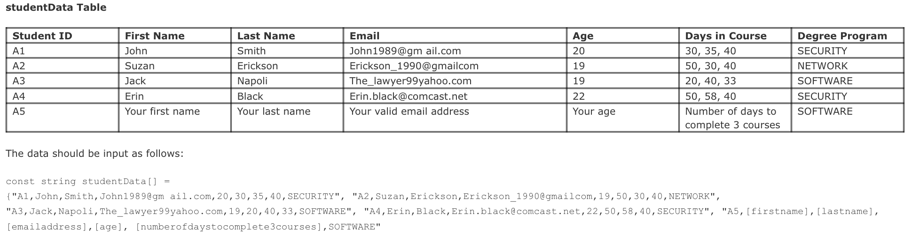

# C867 Scripting and Programming - Applications

## Project Summary

This project involves developing a student roster management system in C++. The system allows for efficient management of student data, including adding new students, displaying student information, and removing students based on specific criteria.

### Scenario

You are hired as a contractor to help a university migrate an existing student system to a new platform using C++. The application already exists, and its requirements are outlined. You are responsible for implementing part of the system based on these requirements, which involves reading and manipulating provided student data. The program will maintain a current roster of students within a given course.

---
### Key Components

1. **Student Class and Subclasses**:
    - Defined a `Student` class and its subclasses to encapsulate student details such as ID, name, email, age, and days in courses.
    - Implemented getter and setter methods for each attribute.

2. **Roster Class**:
    - Created a `Roster` class to manage a collection of `Student` objects.
    - Implemented methods to add, remove, and display students, as well as parse and load student data from a file.

3. **Main Program**:
    - Developed the `main.cpp` file to initialize the `Roster` and demonstrate the functionality of adding, displaying, and removing students.
    - Included error checking and validation to ensure data integrity.

### Files and Documentation

- `degree.h`: Header file defining the degree program enumeration.
- `student.hpp`, `student.cpp`: Files defining and implementing the `Student` class.
- `roster.hpp`, `roster.cpp`: Files defining and implementing the `Roster` class.
- `main.cpp`: Main program file demonstrating the use of the `Roster` class.
- `README.md`: Project documentation.

### Compiled Output

Below is the output of the program when compiled and run:

---

### Requirements

#### A. Personal Information
Modify the “studentData Table” to include your personal information as the last item.

#### B. C++ Project
Create a C++ project in your integrated development environment (IDE) with the following files:
- `degree.h`
- `student.h` and `student.cpp`
- `roster.h` and `roster.cpp`
- `main.cpp`

#### C. Enumerated Data Type
Define an enumerated data type `DegreeProgram` for the degree programs containing the data type values SECURITY, NETWORK, and SOFTWARE.

#### D. Student Class
1. Create the `Student` class in the files `student.h` and `student.cpp`, which includes the required variables.
2. Implement accessor and mutator functions for each variable.
3. Implement a constructor using all input parameters.
4. Implement a `print()` function to print specific student data.

#### E. Roster Class
1. Create an array of pointers, `classRosterArray`, to hold the data provided in the “studentData Table.”
2. Create a student object for each student in the data table and populate `classRosterArray`.
3. Define functions to add, remove, and display students, print average days in course, print invalid emails, and print by degree program.

#### F. Main Program
1. Print course title, programming language used, WGU student ID, and your name.
2. Create an instance of the `Roster` class called `classRoster`.
3. Add each student to `classRoster`.
4. Implement the main program logic using provided pseudo code.
5. Implement the destructor to release the memory allocated dynamically in `Roster`.

#### G. Professional Communication
Demonstrate professional communication in the content and presentation of your submission.

---

### Future Improvements

- Explore additional machine learning algorithms to improve predictive accuracy.
- Implement a user-friendly interface for non-technical stakeholders.
- Conduct further analysis on additional datasets to generalize findings.

---

